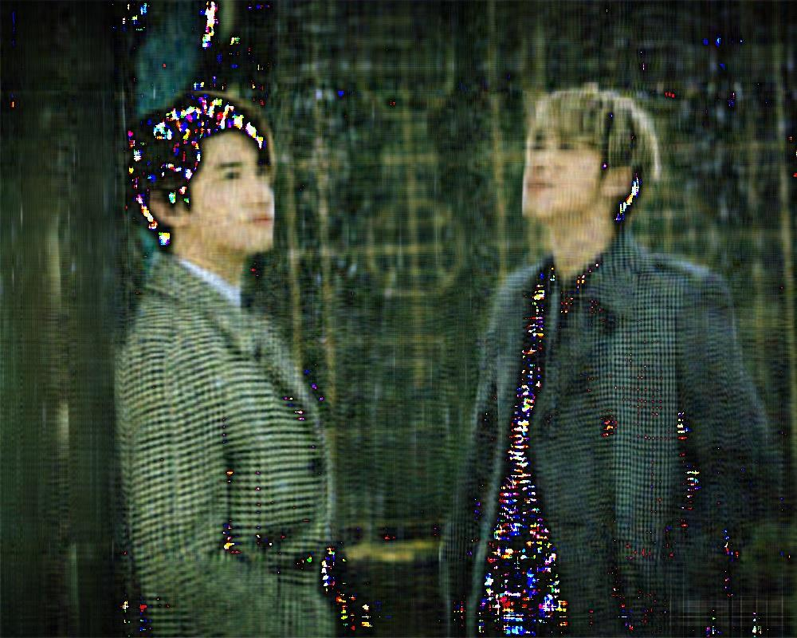

UECM3033 Assignment #2 Report
========================================================

- Prepared by: ** Ng Ann Chee**
- Tutorial Group: T2

--------------------------------------------------------

## Task 1 --  $LU$ Factorization or SOR method

The reports, codes and supporting documents are to be uploaded to Github at: 

<<<<<<< HEAD
[https://github.com/annchee/UECM3033_assign2]
=======
[https://github.com/annchee/UECM3033_assign2](https://github.com/annchee/UECM3033_assign2)
>>>>>>> origin/master

Explain your selection criteria here.
Check strictly diagonally matrix. If the matrix A is strictly diagonally
matrix, then will be solve by LU. Check matrix A is positive definite.
If matrix A is positive definite, then will be solve by SOR.

Explain how you implement your `task1.py` here.
The matrix A is strictly diagonally matrix when diagonal elements is greater than sum of row.
If the result is true, then matrix A is strictly diagonally domimant and solve it by LU. If 
result is false, then check whether matrix A is positive definite. If it is positive definite, then solve
it by SOR.
---------------------------------------------------------

## Task 2 -- SVD method and image compression

Put here your picture file (tohoshinki.jpg)

How many non zero element in $\Sigma$?
$(N \times M-N)$ is used to solve the number of zeros in $\Sigma$ for $M\times N$ size of an image. 

Put here your lower and better resolution pictures. Explain how you generate
these pictures from `task2.py`.
The lower resolution picture

The better resolution picture

A new $\Sigma_i$ with $i$ number of eigenvector used, 30 for lower resolution and 200 for better 
resolution. Then calculate the matrix by U $\Sigma_i$ V for each color layer. Thus, combine
together to become an image in RGB format.

What is a sparse matrix?
The sparse matrix is a matrix in which most of the elements are zero. $\Sigma_i$ is the example
of sparse matrix which contain only $i$ non-zero element out of $N\times M$ element.

-----------------------------------

last modified: 11 March 2016
